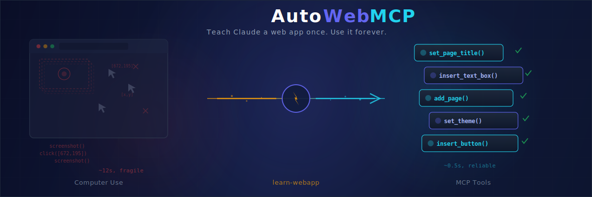

<div align="center">



# AutoWebMCP

### Teach Claude a web app once. Use it forever.

**Stop pixel-hunting. Start calling functions.**

[](https://docs.anthropic.com/en/docs/mcp)
[](https://docs.anthropic.com/en/docs/claude-code)
[](LICENSE)

</div>

---

## The Problem

Claude Code uses [computer use](https://platform.claude.com/docs/en/agents-and-tools/tool-use/computer-use-tool)
to interact with web applications — every session, it rediscovers the app's layout from scratch,
screenshots the screen, clicks coordinates, screenshots again, and repeats. It's slow, fragile,
and wastes time on work Claude has already done before.

## The Solution

AutoWebMCP flips the approach: **teach Claude once, then let it use what it learned forever**
— through [MCP (Model Context Protocol)](https://docs.anthropic.com/en/docs/claude-code/mcp),
Anthropic's open standard for connecting Claude to external tools.

```
/learn-webapp https://sites.google.com
```

That's it. AutoWebMCP explores the app, figures out what operations it supports, and generates
a permanent [MCP server](https://docs.anthropic.com/en/docs/mcp) with semantic tools like
`set_page_title()`, `insert_text_box()`, `add_page()`.

From that point on, Claude calls these tools directly — no screenshots, no coordinate math,
no computer use overhead. Just clean, reliable function calls.

### Before vs After

```
BEFORE (computer use / raw browser automation):
  1. screenshot()                            ~2s
  2. Analyze image to find "title" element   ~3s
  3. Calculate click coordinates             ~1s
  4. computer(click, [672, 195])             ~1s
  5. screenshot() to verify                  ~2s
  6. computer(type, "My New Title")          ~1s
  7. screenshot() to confirm                 ~2s
                                    Total: ~12s, may fail

AFTER (AutoWebMCP → single MCP tool):
  1. set_page_title("My New Title")          ~0.5s
                                    Total: ~0.5s, reliable

AFTER (AutoWebMCP → batch via run_script):
  1. run_script("set title, add 5 pages,     ~1s  (one CDP round-trip
     insert content, set theme")                    for ALL operations)
                                    Total: ~1s, instant
```

---

## Installation

### Option A: Clone the repo (recommended)

```bash
git clone https://github.com/ApartsinProjects/AutoWebMCP.git
cd AutoWebMCP
npm install
```

Then copy skills into your Claude Code project:

```bash
# From your project directory
cp -r path/to/AutoWebMCP/skills/learn-webapp .claude/skills/learn-webapp
cp -r path/to/AutoWebMCP/skills/webmcp .claude/skills/webmcp
cp path/to/AutoWebMCP/src/templates/* src/templates/
```

### Option B: Download release

Download `autowebmcp-v0.1.0.zip` from [Releases](https://github.com/ApartsinProjects/AutoWebMCP/releases), extract, and run:

```bash
./install.sh /path/to/your/project
```

### Prerequisites

- [Claude Code](https://docs.anthropic.com/en/docs/claude-code) with [MCP support](https://docs.anthropic.com/en/docs/claude-code/mcp)
- [Node.js](https://nodejs.org/) 18+
- Google Chrome (for CDP connection)

### Chrome Setup

AutoWebMCP connects to Chrome via the [Chrome DevTools Protocol](https://chromedevtools.github.io/devtools-protocol/).
Start Chrome with remote debugging enabled:

```bash
# macOS
/Applications/Google\ Chrome.app/Contents/MacOS/Google\ Chrome \
  --remote-debugging-port=9222 \
  --user-data-dir="$HOME/chrome-cdp-profile"

# Windows
"C:\Program Files (x86)\Google\Chrome\Application\chrome.exe" ^
  --remote-debugging-port=9222 ^
  --user-data-dir="%LOCALAPPDATA%\Google\Chrome\CDP-Profile"

# Linux
google-chrome --remote-debugging-port=9222 \
  --user-data-dir="$HOME/.chrome-cdp-profile"
```

> **Note**: The `--user-data-dir` flag must point to a non-default directory.
> Chrome requires this for remote debugging to work.

---

## Quick Start

### 1. Learn an app

```
/learn-webapp https://your-app.com
```

AutoWebMCP will:
- Open the app and map its UI
- Discover all available operations
- Show you the tool list for approval
- Generate a ready-to-use MCP server

You stay in control — it asks before clicking anything risky and you approve the final tool list.

### 2. Use it

Next time you ask Claude Code to do anything with that app, it calls MCP tools
instead of falling back to computer use:

```
You:    "Add a new page called About and set the theme to Diplomat"
Claude: Done. 2 MCP tools called, 0 errors.
```

No setup needed. The `/webmcp` skill automatically detects the app, finds the
matching MCP server, and routes through semantic tools — no `screenshot()` or
`computer(click, ...)` calls.

### 3. Share it

```bash
git push
```

Your learned MCP server is now available to anyone who clones the repo. When another
Claude Code user asks to interact with the same app, WebMCP downloads the MCP server
from GitHub automatically — they don't need to learn it again.

---

## What Gets Generated

When you learn an app, AutoWebMCP creates a complete MCP server. For example, learning Google Sites produced **33 tools**:

| Tool | What it does |
|------|-------------|
| `set_site_title` | Set the browser tab title |
| `set_page_title` | Set the hero heading |
| `insert_text_box` | Add a text section with content |
| `set_text_style` | Apply Heading/Subheading/Normal styles |
| `insert_button` | Add a clickable button with a link |
| `insert_divider` | Add a horizontal divider |
| `add_page` | Create a new page |
| `set_theme` | Change the site theme |
| `preview_site` | Enter preview mode |
| `undo` / `redo` | Undo or redo changes |
| ... | *and 23 more* |

Each tool executes JavaScript directly via Chrome DevTools Protocol — replacing
the screenshot-analyze-click loop of [computer use](https://platform.claude.com/docs/en/agents-and-tools/tool-use/computer-use-tool)
with a single function call.

Every generated MCP server also includes:
- **`run_script`** — Execute arbitrary JS in the page context for batch operations or when specific tools fail. All helper functions are auto-injected.
- **`health_check`** — Verify connectivity to the target app
- **`show_scripts`** — List all available functions and their signatures

---

## How It Works (The Simple Version)

```
        You say:                    AutoWebMCP does:
   ┌──────────────┐
   │ "Learn this  │──── Explores the app, discovers operations,
   │  web app"    │     generates an MCP server with semantic tools
   └──────────────┘

   ┌──────────────┐
   │ "Update the  │──── Finds the matching MCP, calls set_title()
   │  title"      │     and insert_text_box() directly — done
   └──────────────┘

   ┌──────────────┐
   │ "Add a       │──── Tool missing? Learns it on the spot,
   │  contact     │     adds to the MCP, keeps going
   │  form"       │
   └──────────────┘
```

Behind the scenes, there are two [Claude Code skills](https://docs.anthropic.com/en/docs/claude-code):

- **`/learn-webapp`** — Explores a web app and generates an [MCP server](https://docs.anthropic.com/en/docs/claude-code/mcp)
- **`/webmcp`** — Intercepts web app tasks and routes them through MCP tools instead of computer use

You only need to remember `/learn-webapp`. The `/webmcp` skill fires automatically
whenever Claude Code is about to interact with a web app that has a learned MCP.

---

## Keeping MCPs Up to Date

Apps change. AutoWebMCP handles that with four re-learning modes:

```
/learn-webapp https://sites.google.com
```

```
An MCP already exists for google-sites (33 tools).
What would you like to do?

  a) Re-learn from scratch — full exploration, new version
  b) Update/extend — keep existing tools, add new ones
  c) Validate & fix — test each tool, fix broken selectors
  d) Learn separate MCP — create an independent tool set
```

---

## The Bigger Picture

Every web app you learn becomes a permanent, shareable MCP server — replacing brittle
computer use with reliable tool calls.

**Today**: You learn Google Sites. Now Claude calls `set_page_title()` instead of
`screenshot()` + `computer(click, [x,y])` + `computer(type, "...")`.

**Tomorrow**: Someone learns Notion. Another person learns Figma. Someone else learns
Salesforce. Each learned app becomes an MCP server in the catalogue.

**The vision**: A growing library of pre-learned web applications that any Claude Code
user can use instantly — downloaded from GitHub on first use, no learning required.

```
catalogue.json
├── google-sites    → 33 tools
├── notion          → 45 tools  (someone contributes this)
├── figma           → 60 tools  (someone contributes this)
├── salesforce      → 80 tools  (someone contributes this)
└── your-app        → you learn it in 5 minutes
```

Every learned app makes the entire ecosystem more capable.

---

## For Contributors

AutoWebMCP is a crowdsourced project. Every MCP server you contribute makes Claude
smarter for everyone — your 5 minutes of learning saves thousands of hours of
brittle computer use across the community.

The catalogue grows with each contribution. When you learn an app and push it,
every Claude Code user who clones this repo (or fetches from the remote catalogue)
gets instant access to your MCP — no learning, no setup, no computer use fallback.
The more apps we cover, the less Claude has to rely on screenshots and pixel-hunting.

### How to contribute

1. **Fork & clone** this repo
2. **Learn** any web app: `/learn-webapp https://your-app.com`
3. **Review** the generated tools — approve, remove, or request additions
4. **Push & open a PR** — your MCP server is now available to the community

### What makes a good contribution

- **Popular apps** that many people use (Google Workspace, Notion, Jira, Figma, etc.)
- **Complete coverage** — approve a generous set of tools, not just 2-3
- **Validated tools** — make sure the generated tools actually work before pushing
- **Clear naming** — use the app's natural name (`gmail`, `notion`, `figma`)

### What happens when you contribute

Your MCP server lands in `MCPs/<app-name>/` and gets registered in `catalogue.json`.
Any Claude Code user who encounters that app will automatically download and use
your MCP instead of falling back to computer use. They don't need to install
anything — the `/webmcp` skill handles it.

## Learn More

- [Computer use tool](https://platform.claude.com/docs/en/agents-and-tools/tool-use/computer-use-tool) — How Claude interacts with browsers today (what AutoWebMCP replaces)
- [Model Context Protocol (MCP)](https://docs.anthropic.com/en/docs/mcp) — The open standard AutoWebMCP generates servers for
- [Claude Code MCP integration](https://docs.anthropic.com/en/docs/claude-code/mcp) — How Claude Code connects to MCP servers
- [docs/](docs/) — Technical details on server structure, mode switches, and catalogue format

## License

MIT
